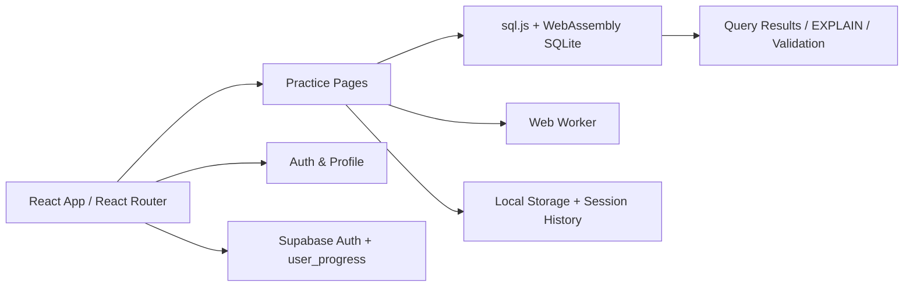

# DataDesk (SQL Practice Environment)

## 🌐 Live Demo

🚀 Live Application:
https://data-desk-pt7h9odve-nidhidhameliyas-projects.vercel.app/

---

## 🧠 Project Overview

DataDesk is a polished, browser-based SQL practice platform for software engineering candidates preparing for technical interviews, coding rounds, and placement drives. The app runs entirely in the browser with WebAssembly-powered SQLite, so users can practice real SQL queries without a backend database server.

The current experience includes guided practice across multiple realistic database domains, company-prep journeys, a custom dataset sandbox, Supabase-backed authentication and progress persistence, and optional AI-assisted hints and questions powered by Groq.

---

## 🚀 Key Features

### In-browser SQL engine
- Executes SQL using sql.js with WebAssembly and dedicated Web Workers
- Keeps the interface responsive while running queries and loading databases
- Supports SELECTs, joins, aggregations, window functions, CTEs, and EXPLAIN QUERY PLAN

### Practice experience
- Browse database-specific question sets with progress tracking
- Validate answers against expected results and inspect execution plans
- Review query history and restore prior queries quickly
- Open interactive ER diagrams and table previews for schema exploration

### Authentication and progress
- Sign in with Google OAuth or email OTP through Supabase Auth
- Persist completed questions, streaks, badges, and recent activity to Supabase
- Keep a local learning history for faster repeat practice

### Sandbox and company prep
- Upload CSV or SQLite files and practice on custom schemas
- Generate AI-assisted MAANG-style questions for uploaded datasets
- Explore interview prep pages for company-specific SQL topics and question banks

### Optional AI assistance
- Request hints and solution review for practice questions
- Generate sandbox questions when a Groq API key is configured

---

## 🏗 Architecture



### Current implementation highlights
- React 19 frontend rendered through Vite and React Router
- Feature-based structure under src/features for practice, auth, gamification, interview, AI, and visualizers
- Database execution is isolated in a shared Web Worker, with the main UI remaining responsive
- Supabase handles authentication, user profile and progress sync, and company/question data
- Local storage stores per-question editor state, query history, and UI preferences

---

## 🛠 Tech Stack

### Frontend
- React 19.2.7
- Vite 8.1.0
- React Router 7.18.0
- Vanilla CSS with a custom design system
- lucide-react for icons

### SQL and editor experience
- @monaco-editor/react 4.7.0
- sql.js 1.14.1
- sql-formatter 15.8.2
- react-zoom-pan-pinch 4.0.3
- react-virtuoso 4.18.10

### Backend and persistence
- @supabase/supabase-js 2.108.2
- Supabase Auth
- Supabase Postgres tables with Row Level Security

### Optional AI integration
- Groq API via the browser client for hints and generated questions

---

## 🔐 Authentication & Backend

DataDesk uses Supabase for authentication and persistence.

### Authentication
- Google OAuth login
- Email-based OTP sign-in
- Session restoration through Supabase Auth
- Protected routes for practice and profile access

### Database layer
The project includes Supabase tables such as:
- user_progress
- companies
- topics
- questions
- question_company_mapping
- question_topic_mapping
- ai_analytics
- interview_sessions

These are defined in [supabase-schema.sql](supabase-schema.sql) and protected with Row Level Security policies.

---

## 📂 Project Structure

```text
DataDesk
├── public/
│   └── databases/          # Preloaded SQLite databases
├── scripts/                # Data generation and maintenance scripts
├── src/
│   ├── data/               # Database metadata, schemas, and questions
│   ├── features/           # Practice, auth, AI, gamification, interview UI
│   ├── hooks/              # Auth, gamification, SQL database hooks
│   ├── lib/                # Supabase, Groq, and app utilities
│   ├── pages/              # Home, practice, guide, company prep, sandbox
│   ├── styles/             # Application styling
│   ├── utils/              # SQL analysis and shortcuts
│   └── workers/            # Web Worker implementation for SQLite
├── supabase/
│   └── migrations/         # Supabase migration files
├── supabase-schema.sql     # Database schema and RLS setup
├── vercel.json             # Vercel routing and cache headers
└── package.json            # App dependencies and scripts
```

---

## 🚀 Deployment

The current frontend is configured for Vercel deployment.

### Production setup
- Build command: npm run build
- Output: Vite static build
- SPA routing handled by vercel.json rewrites

### Required environment variables
Create a .env file in the project root with:

```env
VITE_SUPABASE_URL=your_supabase_url
VITE_SUPABASE_ANON_KEY=your_supabase_anon_key
```

Optional:

```env
VITE_GROQ_API_KEY=your_groq_api_key
```

This key enables optional AI-powered hints, solution review, and sandbox question generation

---

## 💻 Development Setup

```bash
git clone https://github.com/nidhidhameliya/DataDesk.git

cd DataDesk

npm install

npm run dev
```

To build for production:

```bash
npm run build
```

The development server runs locally at:

```text
http://localhost:5174
```

---

## 📸 Screenshots


---

## 🔮 Future Improvements

Potential next steps for the project include:
- Additional interview tracks and question packs
- More advanced SQL analysis and performance insights
- Expanded gamification and mastery dashboards
- Stronger accessibility and mobile UX refinements

---


⭐ Built to help software engineering candidates master SQL through realistic, hands-on database practice.
